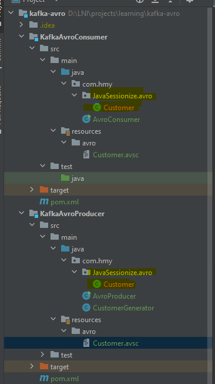
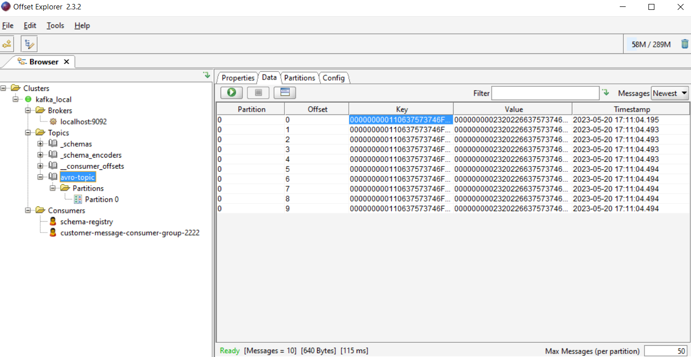
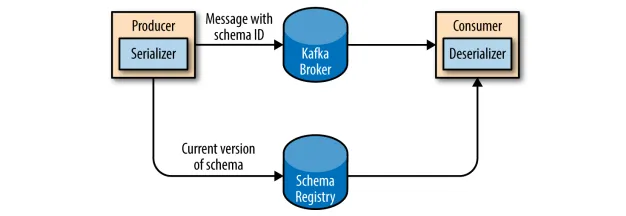
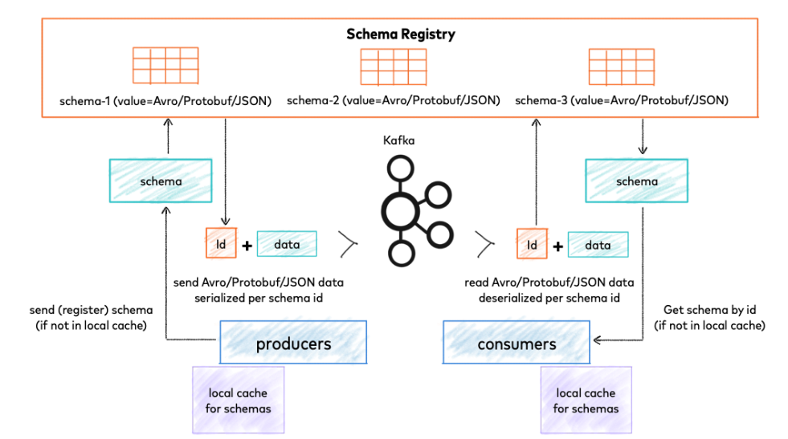

# Demo for Apache Avro with Apache Kafka

# Setup
### Install Confluent Schema Registry Server
#### From Confluent page:
- Step 1: Access this website to install: https://www.confluent.io/installation/
- Step 2: Choose the Community version and click on the Zip link to download it.
#### From GG drive:
- Step 1: Download the `confluent-community-7.4.0.zip` from https://drive.google.com/file/d/16R3cePBKVhucPRLnLty0kjkCSMGpKjuK/view?usp=share_link
- Step 2: Unzip the `confluent-community-7.4.0.zip` to anywhere you want to store it, prefer at the same folder level with this repo
- Step 3: Move bat files from `src/main/resources/avro/`:
  - `start-schema-registry-server.bat` file into `confluent-community-7.4.0` folder
  - `schema-registry-run-class.bat` and `schema-registry-start.bat` file to `.\confluent-community-7.4.0\bin\windows` folder

### Make sure that the zookeeper server and kafka server started

### To run the Schema Registry Server (Confluent platform):
- Step 1: cd to the folder which is you extract it and execute following commands:
- Step 2: Run manual:
  - For Windows: `.\bin\windows\schema-registry-start.bat .\etc\schema-registry\schema-registry.properties`
  - For Linux/Mac: 
- Step 3: Run with bat file: `src/main/resources/avro/start-schema-registry-server.bat`
- Step 4: Make sure all servers are "UP"

### Update some configurations properties:
- Note: No need: Update the listeners url in `schema-registry.properties` file to http://localhost:8081

### Additional configurations for HTTPS:
gghghhjgggy- Update the location path for truststore and keystore:
  ```
  ssl.truststore.location=./kafka.client.truststore.jks
  ssl.truststore.password=<password>
  ssl.keystore.location=./kafka.client.keystore.jks
  ssl.keystore.password=<password>
  ssl.key.password=<password>
  ```
- Document: https://docs.confluent.io/platform/current/sfffygfddfggfgfema-registry/security/index.html#additional-configurations-for-https

### Generate the Avro text file to Avro classes
- Step 1: Download the avro-tools-1.7.7.jar by following this link: http://www.java2s.com/example/jar/a/download-avrotools177jar-file.html#google_vignette
- Step 2: cd to the producer/consumer module on your local
- Step 2: Run the command to auto generate the Avro classes for producer and consumer modules:
  ```
  java -jar <your-directory>\avro-tools-1.7.7.jar compile schema src/main/resources/avro/Customer.avsc src/main/java/com/hmy
  ```
- Step 3: Observe the result:



### Run the producer:
- Click on the main method of `KafkaAvroMessageProducer.java` class and observer the output in the console after executing the main class

### Run the consumer:
- Click on the main method of `KafkaAvroMessageConsumer.java` class and observer the output in the console after executing the main class

After run success and see the result on Offset Explorer tool:


---
# Document
### Apache Avro is a data serialization system, and we can serialize our Java objects using into a compact binary form, Apache Avro supports rich data structures.
https://avro.apache.org/

### Schema Registry Server for Apache Avro schema
https://docs.confluent.io/platform/current/schema-registry/index.html

### Avro Schema Serializer and Deserializer
https://docs.confluent.io/platform/current/schema-registry/fundamentals/serdes-develop/serdes-avro.html

---
For serialization Apache Avro relies on schema, and it serializes Java objects
into binary format in data-files along-with object-schema.

In Apache Kafka for avro based message-serialization instead of making object-schema part of the avro-encoded message
the avro-schema is stored into a separate server known as schema-registry-server and both the message-producer and 
the message-consumer use this schema-registry-server to in order to access the object schema 
when serializing and de-serializing the messages.

Following picture shows how schema-registry-server works with Apache Avro and Apache Kafka:


Why Use Avro As Message Serialization Format?
- By using Apache Avro as a message serialization/de-serialization format we can avoid many unseen compatibility issues 
between different versions of a Java-Object.

Confluent Schema Registry for storing and retrieving schemas:


### Refer:
https://medium.com/@affanhasan88/apache-kafka-installation-step-by-step-8e931c7aa334

https://medium.com/@affanhasan88/how-to-publish-and-consume-avro-encoded-apache-kafka-messages-using-java-44ed42890637

https://github.com/confluentinc/schema-registry/blob/master/core/src/main/java/io/confluent/kafka/schemaregistry/rest/SchemaRegistryMain.java
